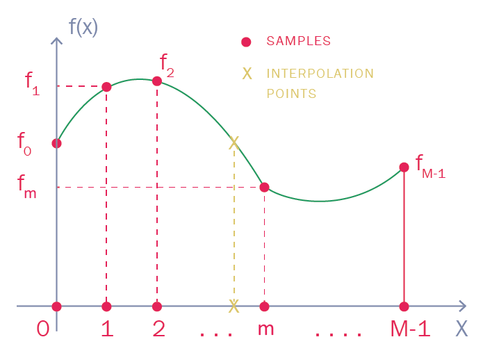
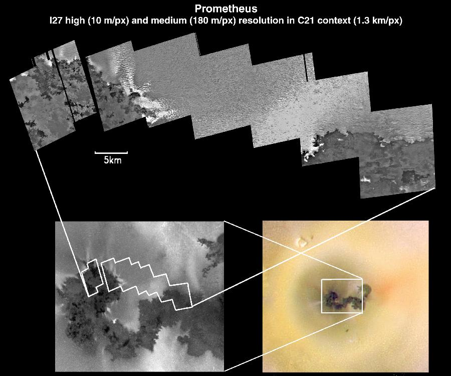
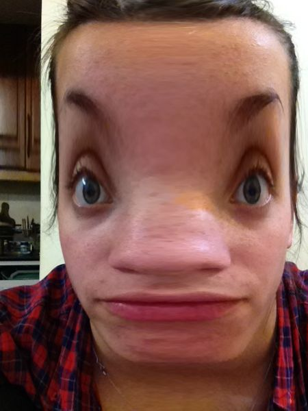
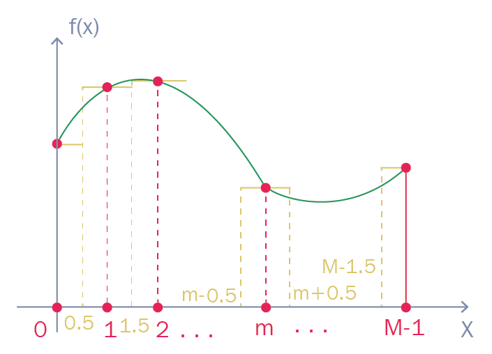
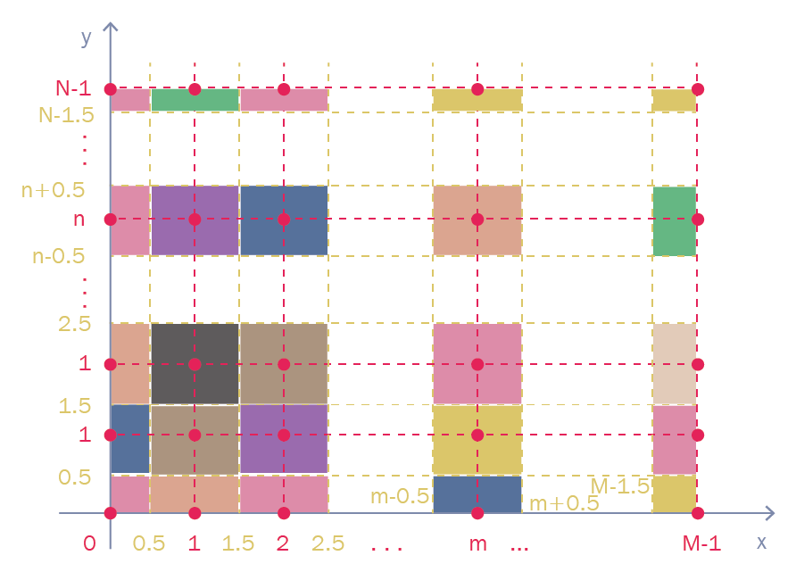
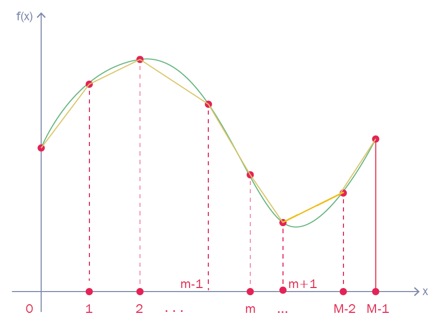
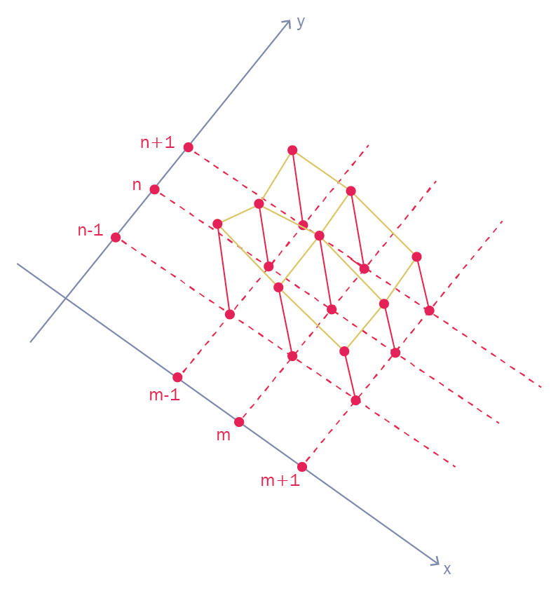

# Writing CUDA kernels for interpolation

In this project, we use CUDA for a simple yet common problem like image interpolation and we get familiar with the functions running on the GPU, the *kernel functions*. Being interpolation very common in technical and scientific applications, the code permits having a tool that can be reused when needed.  
We cover the following topics:

  - Nearest-neighbor interpolation;
  - Linear and bilinear interpolation;
  - CUDA texture memory;
  - Texture filtering;
  - Nearest-neighbor and linear interpolations of a PGM image;
  - Cubic B-spline interpolation;
  - Bicubic B-spline interpolation of a PGM image;
  - Texture lookup;
  - Catmull-Rom interpolation.

Different common interpolation techniques for PGM images are implemented with customized CUDA kernels, also using CUDA texture memory.

## The interpolation problem

Interpolation consists of approximately reconstructing the values of a function by properly combining its samples. The *interpolation points* are the points where the function needs to be reconstructed and are located within the region covered by the function samples, as in Figure [1](#interpolationProblem). Thanks to interpolation, the properties of a function are “coded” within a certain number of properly chosen samples. The problem of reconstructing a function in the region outside that covered by the samples is called *extrapolation*. Extrapolation requires techniques completely different from those used for interpolation and is not dealt with here. Figure [1](#interpolationProblem) below shows an example of the interpolation problem:

<p align="center">
  
  <br>
     <em>Figure 1. The interpolation problem.</em>
</p>

The green curve represents a certain function , the red dots are its samples  used as data for interpolation and we want to reconstruct the function values at the yellow crosses (*interpolation points*) from the knowledge of its samples.  
A very large number of interpolation techniques have been proposed, some using non-equispaced samples and some using equally spaced samples. We will here assume equally spaced samples and will consider the most common interpolation techniques.  
The same techniques that we will illustrate below can be used for one-dimensional, two-dimensional, three-dimensional or multi-dimensional problems, depending on the application. In the present project, interpolation will be applied to image manipulation, hence a two-dimensional one.  
To clarify the application significance, in the framework of image manipulation, interpolation serves different purposes. For example, one may just want to fill the image with intermediate samples besides the available ones, with a procedure known as *increasing image resolution*. This procedure is illustrated below in figure
[2](#increasingResolution):

<p align="center">
  
  <br>
     <em>Figure 2. Applications of interpolation: increasing image resolution.</em>
</p>

As it can be seen from figure [2](#increasingResolution), interpolation enables zooming parts of an image.  
Alternatively, one may want to perform the so-called *image inpainting*, namely, recovering damaged samples. The image inpainting is displayed below in Figure [3](#imageInpainting):

<p align="center">
  
  <br>
     <em>Figure 3. Applications of interpolation: image inpainting.</em>
</p>

In other words, image inpainting enables reconstructing the image at the locations occupied by the “jetphotos.net” banner by exploiting the knowledge of the image at all the other surrounding locations.  
Finally, one may wish to perform geometrical transformations to achieve, for example, the so-called *image warping*. Image warping is illustrated below in Figure [4](#imageWarping):

<p align="center">
  
  <br>
     <em>Figure 4. Applications of interpolation: image warping.</em>
</p>

In this case, the image is required at grid points belonging to a lattice obtained as a distortion of a standard Cartesian sampling.  
Henceforth, we will illustrate how exploiting a particular feature of GPUs, namely, *texture memory*, will enable performing, directly in hardware, basic interpolations as the *nearest-neighbor* (explained in the next section) and *linear interpolation*. Hardware interpolations are indeed very fast, although they have reduced accuracy.  
We will also discuss how more complex interpolations, like cubic B-spline interpolation, may benefit from texture memory. At the end, suggestions on how extending the project in the form of (solved) exercises will be given.

## Nearest-neighbor interpolation

Nearest-neighbor interpolation is the simplest possible form of interpolation and amounts to use the closest sample to interpolate a function at a certain interpolation point. Being the simplest interpolation, rather than calculating a combination of the samples, it simply approximates function values by the nearest-neighboring sample.  
We will discuss nearest-neighbor interpolation with one-dimensional and two-dimensional interpolation.  
One-dimensional interpolation consists of having samples of a function acquired on the real line and returning interpolated values on the real line, as shown below. One-dimensional interpolation is important *per se* because it frequently appears in applications and it is a preliminary step to learn two-dimensional.Figure [5](#nearestNeighborInterpolation) below illustrates one-dimensional interpolation:

<p align="center">
  
  <br>
     <em>Figure 5. Nearest-neighbor interpolation: one-dimensional
case.</em>
</p>

The horizontal yellow segments indicate that the interpolation function is assumed to be constant around the samples.  
The two-dimensional case consists of producing a two-dimensional map of interpolated values. These values start from a two-dimensional map of function samples. Two-dimensional interpolation and, in particular, two-dimensional nearest-neighbor interpolation, is important as it is the case encountered in practice when dealing with image manipulation.
Next, figure [6](#nearestNeighborInterpolation2D) shows two-dimensional nearest-neighbor interpolation:

<p align="center">
  
  <br>
     <em>Figure 6. Nearest-neighbor interpolation: two-dimensional
case.</em>
</p>

The colored boxes around the red dots indicate the constantness of the interpolation function. Although the typical applications for interpolation techniques are two-dimensional, as in the case of image processing, the one-dimensional case will serve for illustration purposes because it is simpler to be described. Furthermore, the two-dimensional case is an immediate extension of the one-dimensional one, yet not introducing any conceptual novelty.  
Let’s address one-dimensional and two-dimensional cases for nearest-neighbor interpolation in the next two subsections.

### Nearest-neighbor interpolation: one-dimensional case

Throughout this chapter and for one-dimensional problems, we will assume that the function  we want to interpolate is a real function of a real argument sampled at the points ,  and that the corresponding function samples are .  
Henceforth, we assume that the function  is required in the interval  and we indicate by  the nearest integer to the generic interpolation point . Accordingly, the nearest-neighbor *interpolating function* can be expressed as:

<p align="center">
         [1]
</p>

Here, equation ([\[1\]](#nearestNeighborInterpolatingFunction)) simply says that, in order to obtain the nearest-neighbor interpolating function, we need to compute the nearest integer to , that is,  and then pick up the function sample with the corresponding index. In C/C++ and CUDA, the value of  can be computed by `round(x)`.  
Interpolation is typically a polynomial approximation of a function. The  superscript in  indicates that nearest-neighbor interpolation exploits a polynomial of degree .

### Nearest-neighbor interpolation: two-dimensional case

Henceforth, for two-dimensional problems, we will assume that the function  we want to interpolate is a real function of two real variables sampled at the points of the two-dimensional Cartesian grid , with  and . Analogously to the foregoing subsection, the interpolating function under the nearest-neighbor scheme is:

<p align="center">
   [2]
</p>

Now that we have revised the nearest-neighbor interpolation, let’s briefly review linear and bilinear interpolations in the next section.

## Linear and bilinear interpolations

Let’s now consider a more accurate form of interpolation, namely, linear interpolation. While nearest-neighbor interpolation does not combine function samples and approximates the function with the nearest sample, linear interpolation is the simplest way to combine function samples to provide interpolation values. One-dimensional linear interpolation is illustrated in the image in figure [7](#linearInterpolation1D):

<p align="center">
  
  <br>
     <em>Figure 7. Linear interpolation: one-dimensional case.</em>
</p>

The yellow segments connect the red samples and represent the broken line providing the linear approximation to .  
The two-dimensional case is illustrated in figure [8](#linearInterpolation2D) below:

<p align="center">
  
  <br>
     <em>Figure 8. Linear interpolation: two-dimensional case.</em>
</p>

As it can be seen, the interpolating function is now represented by facets having the samples as vertices.  
The two-dimensional case is typically referred to as *bilinear interpolation*. Let’s review the one-dimensional and two-dimensional cases for linear interpolation in the next section.

### Linear interpolation: one-dimensional case

In the one-dimensional case, when the interpolation point  lies between the -th and the -th samples, namely,
, linear interpolation consists of linearly approximating  using samples  and  as

<p align="center">
   [3]
</p>

where  and  coincides with the nearest integer not larger than . The superscript  in  indicates that linear interpolation exploits a polynomial of degree . It should be noticed that  is different from . While  is the nearest integer to ,  is the nearest integer *not larger* than , a quantity that in C/C++ and CUDA can be computed by `floor(x)`.  
From equation ([\[3\]](#linearInterpolationEQ)), it is seen that linear interpolation explicitly requires  memory accesses to recover  and  and a linear combination to compute . Nevertheless, as it will be seen next, texture memory is specifically designed to perform those operations directly in hardware.

### Linear interpolation: two-dimensional case

Linear interpolation in the two-dimensional case can be thought of as a
combination of linear one-dimensional interpolations along the \(x\) and
\(y\) axes. Figure [1.9](#linearInterpolation2Dsamples) below
illustrates the linear interpolation in the two-dimensional case:


The previous figure illustrates that two “virtual” samples are first
reconstructed at the yellow dot locations from the four samples at the
four red dot locations. Each of the two virtual samples is reconstructed
by one-dimensional linear interpolations along the \(x\)-axis. Then, the
interpolation value at the yellow cross-location is determined from the
two virtual samples by a one-dimensional linear interpolation along the
\(y\)-axis.  
More formally, the interpolating function at the interpolation point
denoted with a cross in figure [1.9](#linearInterpolation2Dsamples) and
having coordinates \((x,y)\) is achieved from \(4\) samples:
\(f_{m,n}\), \(f_{m+1,n}\), \(f_{m,n+1}\) and \(f_{m+1,n+1}\). The final
result is achieved by first constructing the virtual sample represented
by the upper empty circle in figure [1.9](#linearInterpolation2Dsamples)
and computed as a linear interpolation of \(f_{m,n+1}\) and
\(f_{m+1,n+1}\) along the \(x\) axis, namely:

\[\label{partialLinearInterpolation2D}
f_{x,n+1}=(1-\alpha_x)f_{m,n+1}+\alpha_x f_{m+1,n+1},\]

where \(\alpha_x=x-m\). Later on, the virtual sample \(f_{x,n}\)
corresponding to the lower empty circle in figure
[1.9](#linearInterpolation2Dsamples) is constructed and worked out as a
linear interpolation of \(f_{m,n}\) and \(f_{m+1,n}\) along the \(x\)
axis, that is:

\[\label{partialLinearInterpolation2D_v2}
f_{x,n}=(1-\alpha_x)f_{m,n}+\alpha_x f_{m+1,n}.\]

Finally, the desired value \(f^{(1)}(x,y)\) is achieved as a linear
interpolation of \(f_{x,n}\) and \(f_{x,n+1}\) along the \(y\)-axis,
namely,

\[\label{linearInterpolation2Dfull}
f^{(1)}(x,y)=(1-\alpha_y)f_{x,n}+\alpha_y f_{x,n+1},\]

where \(\alpha_y=y-n\).  
The final bilinear interpolation formula can be obtained by substituting
equations
([\[partialLinearInterpolation2D\]](#partialLinearInterpolation2D)) and
([\[partialLinearInterpolation2D\_v2\]](#partialLinearInterpolation2D_v2))
in ([\[linearInterpolation2Dfull\]](#linearInterpolation2Dfull)), but
its expression is not really needed and is here omitted for the sake of
brevity.  
Let’s pause with theory and temporarily go towards practice,
illustrating how the texture memory works in CUDA.

## Towards practice: CUDA texture memory

Programmers with experience in graphics may already know texture memory
since texture units are designed and typically employed for rendering
pipelines in OpenGL and DirectX. Nevertheless, texture memory is also
much useful for High-Performance Computing (HPC).  
Programmers who are involved in non-graphics applications (like the
industrial and scientific HPC applications covered in the present book)
use texture memory as a read-only cache. Such a memory is located
on-chip, namely, on the same chip of the processing units (the GPU cores
in our case), to decrease latency for frequently used data.  
This can help improve memory access performance when global memory data
reads have certain access patterns. Global memory is indeed located
off-chip, namely, on a chip different from that of the processing units
while texture caches are conceived having in mind applications where
memory access shows much *spatial locality*.  
To understand this point, figure [1.10](#textureMemory) illustrates an
example which refers to \(4\) threads accessing neighboring pixels of a
two-dimensional image:


Figure [1.10](#textureMemory) illustrates how, in a typical CPU caching
scheme, the \(4\) accessed memory locations would not be stored at
consecutive memory addresses so that they would not be cached together.
On the other side, texture caches those global memory locations together
to accelerate access patterns such as the illustrated one. This result
is achieved by transferring the two-dimensional spatial locality through
a mapping based on a *z-curve*-like concept.  
We will overlook further details on z-curve-like caching, which is not
of strict interest for the present project. The interested Reader can
refer to  for some details. Actually, in this project, we will not use
texture memory to speed up memory fetches, but rather to perform fast
interpolations, also known as *texture filtering* .  
Indeed, when the texture is accessed using non-integer indices, it
returns the interpolation between neighboring stored values. Such
interpolation can be a nearest-neighbor or linear, namely, of the two
types discussed above. Performing interpolation using texture memory has
the indubitable advantage that such operation is performed by dedicated
hardware circuitry, therefore it is worked out very fast.  
Nonetheless, speed is paid with accuracy in the linear case since
interpolation coefficients are stored in a fixed point format having
\(9\)-bit overall with \(8\) bits of fractional value.  
Figures [1.11](#textureNearestNeighbor) and [1.12](#textureLinear) are
not a mere repetition of Figures [1.5](#nearestNeighborInterpolation)
and [1.7](#linearInterpolation1D), but they illustrate how interpolation
is achieved with texture filtering in the one-dimensional case and when
un-normalized coordinates are employed (the term “un-normalized
coordinates” will be clear in a while). In particular, they show the
behavior of the `tex1D()` function which is the CUDA function performing
texture filtering in a one-dimensional case both for the
nearest-neighbor and linear interpolations. For nearest-neighbor
interpolation, \(tex1D(x)=f_m\), \(m\leq x < m+1\),
\(m=0,1,\ldots,M-1\), while, for linear interpolation, `tex1D()` is the
result of the linear interpolation between \(f_m\) and \(f_{m+1}\), for
\(m+0.5\leq x\leq m+1+0.5\) and \(m=0,1,\ldots,M-2\). In both cases, it
can be seen that

\[\label{generalInterpolationTex}
f^{(p)}(x)=tex1D(x+0.5), \;\; p=0,1.\]

Nearest-neighbor interpolation using texture filtering is illustrated in
figure [1.11](#textureNearestNeighbor) below:


Figure [1.11](#textureNearestNeighbor) represents the hardware
implementation of Figure [1.5](#nearestNeighborInterpolation). The
difference between them is that the interpolation function is not
constant around each interpolation sample, but rather between two
consecutive interpolation samples which are responsible for the \(0.5\)
shift.  
On the other side, figure [1.12](#textureLinear) below illustrates
linear interpolation using texture filtering:


Figure [1.12](#textureLinear) represents the hardware implementation of
Figure [1.7](#linearInterpolation1D). In figure [1.12](#textureLinear),
the interpolation function is not linear between samples as in figure
[1.7](#linearInterpolation1D), but there is again a \(0.5\) shift.  
According to equation
([\[generalInterpolationTex\]](#generalInterpolationTex)), we should
remember to take care of the \(0.5\) shift needed to use texture
filtering in the sequel. The need for such a shift also occurs for the
two-dimensional case. Indications on how using texture memory for
filtering are now in order.  
Texture memory must be associated, at run-time and by proper function
calls, to a memory region, the texture, before being available to use in
a kernel. Furthermore, a texture has several attributes which we will
need to use:

  - *dimensionality*: it indicates if the texture is accessed as a
    one-dimensional array by one coordinate, a two-dimensional array by
    two coordinates, or a three-dimensional array by three coordinates;

  - *types*: these are input and output data types;

  - *coordinate scaling*: figures [1.11](#textureNearestNeighbor) and
    [1.12](#textureLinear) show texture filtering in the case of
    un-normalized coordinates; in other words, the coordinate by which
    texture is accessed belongs to the interval \([0,M[\); a different
    possibility is using *normalized coordinates* in which the \([0,M[\)
    interval is compressed to \([0,1[\); in the present project, we will
    use un-normalized coordinates;

  - *filtering mode*: it specifies whether interpolation is the
    nearest-neighbor or linear;

  - *address mode*: it specifies the “boundary conditions”, namely, what
    texture filtering returns when the access coordinate is outside
    \([0,M[\); for example, the texture values can be prolonged by
    zeros, or periodically, or with the last sample or by a mirroring of
    the \([0,M[\) interval .

A very important thing to remember when using textures is that texture
cache is not coherent. This means that texture fetching from addresses
that have been modified by global stores return undefined data if both
the operations are performed in the same kernel call. In other words, a
thread can consistently texture fetch a memory location if the location
has been updated by a previous kernel call or memory copy, i.e., outside
the current kernel call.  
Now that we have a picture of what texture memory and texture filtering
are, let’s investigate how the latter is implemented in CUDA.

## Getting familiar with texture filtering in the one-dimensional case

To get familiar with the nearest-neighbor and linear interpolations with
texture filtering, we will now consider a simple one-dimensional case.
We will illustrate a getting-started code as a sequence of code
snippets. For the sake of clarity, the sequence of code snippets will
not be the same as they appear in the full code.  
Let’s begin with the first part of the code defining the texture
reference in Listing [\[texture\_1\]](#texture_1):

``` c++
#include <stdio.h>

texture<float, 1> tex;

#define cudaCHECK(ans) { checkAssert((ans), __FILE__, __LINE__); }

inline void checkAssert(cudaError_t errorCode, const char *file, 
    int line, bool abort = true){
    if (errorCode != cudaSuccess){
        fprintf(stderr, "Check assert: %s %s %d\n",
           cudaGetErrorString(errorCode), file, line);
        if (abort) exit(errorCode);}}
```

As can be seen, one-dimensional, float-type texture memory is declared.
Relevantly, such a declaration does not allocate storages and does not
associate storage with the textured handle.  
Then, the number of threads per block to be used in the subsequent
kernel calls is defined and, finally, the `cudaCHECK()` function appears
. Such a function enables performing the error check either on CUDA
kernel invocations or on CUDA API calls. Indeed, CUDA APIs return an
error code providing information on possible errors. By decorating CUDA
APIs with `cudaCHECK()`, it is possible to “read” such error codes. The
use of `cudaCHECK()` or of other error check functions is of the utmost
importance when coding in CUDA.  
Let’s now jump to the `main()` function in Listing
[\[texture\_2\]](#texture_2):

``` c++
int main(){
    // --- Number of samples
    int numInSamples = 5;
    // --- Number of interpolated samples
    int numOutSamples = 7;
    // --- Input data on host and device
    float *h_samples = (float*)malloc(numInSamples * sizeof(float));
    for (int ind = 0; ind < numInSamples; ind++) {
        h_samples[ind] = (float)ind / (float)numInSamples;
        printf("index = %d; datum = %f\n", ind, h_samples[ind]);}
    printf("\n\n");
    float* d_samples; 
    cudaCHECK(cudaMalloc(&d_samples, sizeof(float) * numInSamples));
    cudaCHECK(cudaMemcpy(d_samples, h_samples, sizeof(float) * 
       numInSamples, cudaMemcpyHostToDevice));
    // --- Output sampling
    float *h_xCoord = (float *)malloc(numOutSamples * sizeof(float));
    h_xCoord[0] = -0.6f; h_xCoord[1] = -0.1f; h_xCoord[2] = 0.6f;
    h_xCoord[3] = 1.5f; h_xCoord[4] = 2.1f; h_xCoord[5] = 2.9f; 
    h_xCoord[6] = 4.7f;
    float *d_xCoord; 
    cudaCHECK(cudaMalloc(&d_xCoord, sizeof(float) * numOutSamples));
    cudaCHECK(cudaMemcpy(d_xCoord, h_xCoord, sizeof(float) * 
       numOutSamples, cudaMemcpyHostToDevice));
    textureFiltering(h_samples, d_samples, d_xCoord, numInSamples, 
       numOutSamples);
    return 0;}
```

As it can be seen, the sequence `h_samples` is made of \(5\) samples:
\(0, 0.2, 0.4, 0.6, 0.8\). In other words,

\[f_m=m \times 0.2, \;\; m=0,\ldots,4.\]

The coordinates of \(7\) interpolation points `h_x` are then defined:

\[x_0=-0.6, x_1=-0.1, x_2=0.6, x_3=1.5, x_4=2.1, x_5=2.9, x_6=4.7.\]

These arrays are then transferred to the GPU memory. Finally, the
`textureFiltering()` function performs the texture-based interpolations
and displays the results.  
The `textureFiltering()` function is shown in Listing
[\[texture\_3\]](#texture_3) below:

``` c++
void textureFiltering(float *h_samples, float *d_samples, float 
    *d_xCoord, int numInSamples, int numOutSamples) {
    
    cudaArray* d_cudaArrayData = NULL;
    cudaMallocArray(&d_cudaArrayData, &tex.channelDesc, numInSamples, 1);
    cudaMemcpyToArray(d_cudaArrayData, 0, 0, h_samples, 
        sizeof(float) * numInSamples, cudaMemcpyHostToDevice);
    cudaBindTextureToArray(tex, d_cudaArrayData);
    tex.normalized = false;
    tex.addressMode[0] = cudaAddressModeClamp;
    //tex.addressMode[0] = cudaAddressModeBorder;
    //tex.addressMode[0] = cudaAddressModeWrap;
    //tex.addressMode[0] = cudaAddressModeMirror;
    tex.filterMode = cudaFilterModePoint;
    
    textureFilteringKernelNerp << <1, numOutSamples >> >( d_samples, 
        d_xCoord, numInSamples);
    cudaCHECK(cudaPeekAtLastError());
    cudaCHECK(cudaDeviceSynchronize()); printf("\n\n");
    
    tex.filterMode = cudaFilterModeLinear;
    textureFilteringKernelLerp << <1, numOutSamples >> >(
        d_samples, d_xCoord, numInSamples);
    cudaCHECK(cudaPeekAtLastError());
    cudaCHECK(cudaDeviceSynchronize());}
```

To explain Listing [\[texture\_3\]](#texture_3), let us mention that
CUDA textures are bound to CUDA arrays which are opaque memory layouts
having dimensionality one, two, or three and optimized for texture
fetching. After having defined the `cudaArray` and transferred the host
data, `cudaBindTexture()` is used to bind the texture reference to the
memory buffer. This informs the CUDA runtime of the following:

  - we mean using the buffer specified in `cudaArray` as a texture;

  - we mean using the texture reference at hand as the “texture’s name”.

We furthermore notify CUDA that we intend to use un-normalized
coordinates, as mentioned above, by `tex.normalized = false`. We also
inform CUDA on how to prolong the data outside the sampling interval. As
already said, different possibilities are available. In the above
example, we use `tex.addressMode[0] = cudaAddressModeClamp`. This means
that the samples are prolonged as follows:

\[f_m=f_0, \;\; m<0\]

and

\[f_m=f_{M-1}, \;\; m\geq M.\]

The `textureFiltering()` function is set up to easily change the
prolongation modality. It is enough to just comment the currently
running line and uncomment the desired address mode. It should be
noticed that `tex.addressMode` is indexed. For the current example, only
one index is of interest, being the texture one-dimensional, but, in
principle, for two or three-dimensional textures different address modes
can be chosen for different dimensions (see exercise
[\[addressModes\]](#addressModes)).  
Finally, the desired filtering type should be chosen. Nearest-neighbor
interpolation is achieved by launching the
`textureFilteringKernelNerp()` kernel and setting `tex.filterMode =
cudaFilterModePoint`.

The name of the kernel function contains the “nickname” *NERP* typically
used to denote nearest-neighbor interpolation.

Later on, linear interpolation is obtained by launching the
`textureFilteringKernelLerp()` kernel function and setting
`tex.filterMode = cudaFilterModeLinear`.

Also the name of the latter kernel function contains the “nickname”
*LERP* typically used to indicate linear interpolation.

In both the cases of nearest-neighbor and linear interpolations, once
`tex.filterMode` has been defined, our texture is set up and ready to be
used.  
Let us analyze first the `textureFilteringKernelNerp()` kernel function
reported in Listing [\[texture\_4\]](#texture_4):

``` c++
__global__ void textureFilteringKernelNerp(const float * 
    __restrict__ d_samples, const float * __restrict__ d_xCoord, const int 
    numInSamples){
    int tidx = threadIdx.x + blockDim.x * blockIdx.x;
    float nn;
    int ind = (int)round(d_xCoord[tidx]);
    if (d_xCoord[tidx] < 0)
        nn = d_samples[0];
    else if (d_xCoord[tidx] > numInSamples - 1)
        nn = d_samples[numInSamples - 1];
    else
        nn = d_samples[ind];
    printf("argument = %f; texture = %f; nearest-neighbor = 
        %f\n", d_xCoord[tidx], tex1D(tex, (d_xCoord[tidx]) + 0.5), nn);}
```

This kernel function prints the results of nearest-neighbor texture
filtering by invoking `tex1D` `(tex,(d_xCoord[tidx])+0.5)` which
evaluates \(f^{(0)}\) at `d_xCoord[tidx]`. The need for the \(0.5\)
shift has been already explained above. The value of nearest-neighbor
texture filtering is compared with an analogous “manual” interpolation.
Manual nerp is simply achieved by picking up the sample with index
nearest to `d_xCoord[tidx]`, by calling the `round()` function.  
The `if...else` conditions are just needed to check whether
`d_xCoord[tidx]` falls within the interpolation interval and, if not,
clamping is used. In other words, if `d_xCoord[tidx]` is located at the
left of the interpolation interval, `d_samples[0]` is taken as
nearest-neighbor interpolation value. Opposite to that, if
`d_xCoord[tidx]` is on the right side of the interpolation interval,
`d_xCoord[M-1]` is picked up.  
The results of both nearest-neighbor and linear filterings for the
considered example are illustrated in figure
[1.13](#interpolationExample) below:


The red dots refer to the samples, the black dots are the results of
nearest-neighbor interpolation and the green dots are the results of
linear interpolation. The green dots surrounded by a black circumference
mean that the results of the nearest-neighbor and linear interpolation
coincide.  
Let us now consider the kernel function performing the linear texture
filtering reported in Listing [\[texture\_5\]](#texture_5):

``` c++
__global__ void textureFilteringKernelLerp(const float * 
    __restrict__ d_samples, const float * __restrict__ d_xCoord,  const int numInSamples){
    int tidx = threadIdx.x + blockDim.x * blockIdx.x;
    float ll;
    if (d_xCoord[tidx] < 0)
        ll = d_samples[0];
    else if (d_xCoord[tidx] > numInSamples - 1)
        ll = d_samples[numInSamples - 1];
    else {
        int ind = floor(d_xCoord[tidx]);
        float alpha = d_xCoord[tidx] - ind;
        ll = (1.f - alpha) * d_samples[ind] + 
            alpha * d_samples[ind + 1];}
    printf("argument = %f; texture = %f; linear = %f\n", d_xCoord[tidx],
    tex1D(tex, (d_xCoord[tidx]) + 0.5), ll);}
```

The kernel function is constructed symmetrically with respect to the
foregoing one. It shows the results of the linear interpolation by
invoking `tex1D(tex, d_xCoord[tidx] + 0.5)` which, this time, performs a
linear interpolation instead of nearest-neighbor interpolation since we
have used `tex.filterMode = cudaFilterModeLinear`. Texture filtering is
once again compared with “manual” linear interpolation. A relevant thing
to note is that the largest index of the sample not larger than the
interpolation point `d_xCoord[tidx]` is obtained by using the `floor()`
function. The result of linear texture filtering for the considered
example is shown in figure [1.13](#interpolationExample).  
Finally, let us observe that, when running the full example, a
difference between the texture filtering result and that associated with
the “exact” linear interpolation according to equation
([\[linearInterpolationEQ\]](#linearInterpolationEQ)) can be
appreciated. Such a difference is related to the lower accuracy of
texture filtering, as already above mentioned.  
Once we have made practice on texture filtering in a simplified setting,
we are ready to face interpolation using texture filtering on a full
image.

## Practice: Nearest-neighbor and linear interpolations of a PGM image

We are now ready to move a step forward towards the project of interest.
In particular, we will read a PGM (Portable Gray Map) image from a file,
we will perform the nearest-neighbor and linear interpolations and,
finally, we will save the result again in a PGM image. The choice of the
PGM format is due to the fact that it is designed to be extremely easy
to learn and manipulate. It is nevertheless convenient to provide a
short recall.  
A PGM image is a grayscale image whose pixels, or “dots” on the screen,
are encoded with one or two bytes (\(8\) or \(16\) bits). A PGM file
provides for a header containing information on the file itself and on
the image and an array of numbers representing the different shades of
gray of the generic pixel, ranging from black (\(0\)) to white (up to
\(65,536\)). PGM images are typically stored as ASCII files, but we will
here deal with a binary representation. Binary PGM files are encoded
with a single byte.  
The first line contains the header which reports the format: “P2” for
text or “P5” for binary. In our case, the format type should be “P5”.
The second line optionally contains a comment. The line is a comment if
it starts with “\#”. In the case the second line is a comment, the next
line contains the image size in terms of `width x height` along with the
maximum number of shades.  
The latter number is \(255\) for binary PGM images. In the case the
second line is not a comment, then it is the second line that contains
that information. After that, the image is represented by an array of
grey shades, one per each pixel.  
An example of binary PGM image is shown below:

``` c++
P2
# A 16x16 black background with white diagonal
16 16
255
255 0 0 0 0 0 0 0 0 0 0 0 0 0 0 0
0 255 0 0 0 0 0 0 0 0 0 0 0 0 0 0
0 0 255 0 0 0 0 0 0 0 0 0 0 0 0 0
0 0 0 255 0 0 0 0 0 0 0 0 0 0 0 0
0 0 0 0 255 0 0 0 0 0 0 0 0 0 0 0
0 0 0 0 0 255 0 0 0 0 0 0 0 0 0 0
0 0 0 0 0 0 255 0 0 0 0 0 0 0 0 0
0 0 0 0 0 0 0 255 0 0 0 0 0 0 0 0
0 0 0 0 0 0 0 0 255 0 0 0 0 0 0 0
0 0 0 0 0 0 0 0 0 255 0 0 0 0 0 0
0 0 0 0 0 0 0 0 0 0 255 0 0 0 0 0
0 0 0 0 0 0 0 0 0 0 0 255 0 0 0 0
0 0 0 0 0 0 0 0 0 0 0 0 255 0 0 0
0 0 0 0 0 0 0 0 0 0 0 0 0 255 0 0
0 0 0 0 0 0 0 0 0 0 0 0 0 0 255 0
0 0 0 0 0 0 0 0 0 0 0 0 0 0 0 255
```

It defines a `16x16` black and white image with black background (the
`0`’s) and white diagonal (the `255`’s).  
Many PGM images that can be used to play with the codes in this project
can be downloaded from
<http://people.sc.fsu.edu/~jburkardt/data/pgmb/pgmb.html>.  
In the project at hand, the function `loadPGMImageAndInitTexture()`
loads the PGM image to be interpolated, while the function
`writePGMImage()` writes the interpolated image. We will not go through
the details of PGM image read-writes and essentially use those functions
as black-boxes. Nevertheless, `loadPGMImageAndInitTexture()` also
initializes the texture which, in our relevant example, is a
two-dimensional texture.  
The initialization is performed by invoking the `initTexture()` function
whose details are reported in Listing [\[texture\_6\]](#texture_6):

``` c++
void initTexture(int imageWidth, int imageHeight, unsigned char
    *h_samples){
    // --- Allocate CUDA array and copy image data
    cudaChannelFormatDesc channelDescrptr = 
    cudaCreateChannelDesc (8, 0, 0, 0, 
    cudaChannelFormatKindUnsigned);
    cudaCHECK(cudaMallocArray(&d_imageArray, &channelDescrptr, 
        imageWidth, imageHeight));
    unsigned int sz = imageWidth * imageHeight * 
        sizeof(unsigned char);
    cudaCHECK(cudaMemcpyToArray(d_imageArray, 0, 0, h_samples, 
        sz, cudaMemcpyHostToDevice));
    free(h_samples);
    // --- Texture set up
    texReference.addressMode[0] = cudaAddressModeClamp;
    texReference.addressMode[1] = cudaAddressModeBorder;
    //texReference.addressMode[1] = cudaAddressModeClamp;
    texReference.filterMode = cudaFilterModeLinear;
    texReference.normalized = false;
    // --- Texture binding
    cudaCHECK(cudaBindTextureToArray(texReference, 
        d_imageArray));}
```

As can be seen, the texture filtering mode is initialized to linear, but
this setting will be changed in the sequel. Moreover, the address mode
is *clamp* in the two dimensions. This setting will be kept fixed in the
following examples. Finally, the un-normalized coordinates will be
used.  
After having loaded the PGM image and initialized the texture, we report
in the following Listing [\[texture\_7\]](#texture_7) the kernel
function that will be used for nearest-neighbor and linear
interpolations:

``` c++
__global__ void nalKernel(unsigned char * __restrict__  d_interpSamples, 
    const unsigned int imWidth, const unsigned int imHeight, 
    const float transl_x, const float transl_y, const float 
    scaleFactor, const float xCenter, const float yCenter){
    
    const int tidx = blockIdx.x * blockDim.x + threadIdx.x;
    const int tidy = blockIdx.y * blockDim.y + threadIdx.y;
    float xNew = (tidx - xCenter) * scaleFactor + xCenter + transl_x;
    float yNew = (tidy - yCenter) * scaleFactor + yCenter + transl_y;
    if ((tidx < imWidth) && (tidy < imHeight)){
        float outSample = tex2D(texReference, xNew + 0.5f, yNew + 0.5f);
        d_interpSamples[tidy * imWidth + tidx] = outSample * 0xff;}}
```

In the kernel above, `tidx` and `tidy` represent the `x` and `y`
coordinates of each pixel, while `xNew` and `yNew` represent the new
coordinates calculated after the translation and scaling operations.  
The same kernel function is used for both the nearest-neighbor and
linear texture-based interpolations. Indeed, it will be enough to change
the address mode from `point` to `linear` to change the operation of
such function from nearest-neighbor to linear. The name of the kernel
function is evocative of that. Indeed, “nal” means Nerp And Lerp. In
both cases, texture filtering is achieved by the `tex2D()` function and
the `+0.5` shifts in the texture coordinates are due to the already
mentioned texture convention related to how `text2D()` works.  
The kernel function uses three parameters: `transl_x`, `transl_y` and
`scaleFactor`. They define the translations along \(x\) and \(y\) and a
scale factor, respectively. If `scaleFactor > 1`, the interpolation
performs a zoom out, while if `scaleFactor < 1`, the interpolation
performs a zoom in.  
To better understand the meaning of the mentioned parameters, let us
consider a practical example.  
Figure [1.14](#Fig9a) below illustrates the `512x512` image (“*Basilica
Julia*”) used here and in the following to analyze the performance of
the developed interpolation codes:

).](/Chapter01/Fig9a.png)

Figure [1.15](#Fig9b) below shows the result of applying
nearest-neighbor interpolation to the original image when `transl_x
= 0`, `transl_y = 0` and `scaleFactor = 1`:

).](/Chapter01/Fig9b.png)

These parameters correspond to zero translation and zoom, namely, to
recompute the image exactly in the same `512x512` original points.
Obviously, Figures [1.14](#Fig9a) and [1.15](#Fig9b) coincide.  
Figure [1.16](#Fig9c) below refers to zero translation, namely,
`transl_x = 0` and `transl_y = 0`, but `scaleFactor = 2`, namely, a
double zoom out is performed:

).](/Chapter01/Fig9c.png)

In other words, we have changed `scaleFactor` from `1` to `2`, while
keeping the original values of `transl_x` and `transl_y`.  
A zoom-in appears with features outside the image due to the particular
kind of chosen texture prolongation. As can be seen, the original image
dimensions are now halved, while features appear on its exterior. The
external features represent the prolongation of the image according to
the address mode clamp. The image at the center appears smaller since
the chosen parameters correspond to a `x2` decimation.  
Figure [1.17](#Fig9d) below illustrates the reconstruction which
corresponds again to `transl_x = 0` and `transl_y = 0`, but to
`scaleFactor = 0.5` meaning a two-fold zoom in:

).](/Chapter01/Fig9d.png)

We have again changed `scaleFactor` from `2` to `0.5`, while keeping the
original values of `transl_x` and `transl_y`. Indeed, the reconstruction
now simply represents the central part of the Basilica Julia. A zoom-in
effect appears. In this case, the original picture has been sampled by
performing reconstructions also at points in between the original
samples.  
Let us conclude this tracking shot by considering the reconstruction
with `transl_x = 100`, `transl_y = 100` and `scaleFactor = 1/8`. Figure
[1.18](#Fig9e) below illustrates the result of such a reconstruction:

).](/Chapter01/Fig9e.png)

We have now changed both `transl_x` and `transl_y` from `0` to `100` and
`scaleFactor` from `0.5` down to `1/8`.This means that we have performed
an even larger magnification (`8 to 1`) and that we have translated the
reconstruction window so to catch a detail of the Basilica Julia
fringes.  
As mentioned before, the same kernel can be used to perform linear
interpolations also by simply changing the filtering modality. The
smoothness/accuracy can be appreciated in figure [1.19](#Fig9f) below:

).](/Chapter01/Fig9f.png)

The `transl_x`, `transl_y`, and `scaleFactor` parameters are the same as
before. In figure [1.19](#Fig9f) above, the same reconstruction of
figure [1.18](#Fig9e) is shown, but now by performing a bilinear
interpolation. The image appears smoother than before.  
Following an interlude of practice, let us now come back to theory to
make the last analytical effort and understand the details of cubic
B-spline interpolation.

## Understanding cubic B-spline interpolation

From the mathematical point of view, nearest-neighbor and linear
interpolations correspond to approximate a function whose samples are
known using zero-th and first-order polynomials, respectively. Moreover,
in the foregoing section, we have learned how linear interpolation is
capable to improve the nearest-neighbor interpolation.  
It can then be expected that increasing the degree of the interpolation
polynomial leads to increased interpolation quality. In this section,
with the aim of stepping forward, we will:

1.  discuss cubic interpolation (based on third-order polynomials);
    alternatively, for the sake of simplicity, we will again lead a
    preliminary one-dimensional discussion;

2.  introduce cubic B-spline interpolation; this is the particular cubic
    interpolation of interest here;

3.  show how cubic B-spline interpolation can be implemented as a
    texture filtering;

4.  extend the one-dimensional scheme to two dimensions to solve the
    problem known as *bicubic interpolation*.

We will explore these instructions on a step-by-step basis in the
following sections. Let us start with cubic interpolation.

### Cubic interpolation

To begin with, figure [1.20](#interpolationCubic) below illustrates
cubic interpolation:


The above figure shows that, in order to know the function at the
interpolation point represented by the cross, we need two samples on its
left and two samples on its right.  
Let us recall that, in the one-dimensional case, nearest-neighbor
interpolation used only one sample per interpolation interval
\((m,m+1)\), being represented by a zero-th order polynomial. Moreover,
linear interpolation used two samples per interpolation interval
\((m,m+1)\), being represented by a first-order polynomial. As it can be
seen from figure [1.20](#interpolationCubic), cubic interpolation uses
four samples per interpolation interval, being represented by a
third-order polynomial. In particular, to reconstruct the function
\(f(x)\) in \((m,m+1)\), the four samples \(m-1\), \(m\), \(m+1\) and
\(m+2\) are now needed.  
We now proceed towards cubic B-spline interpolation.

### Cubic B-spline interpolation

In this project, we will use a particular kind of cubic interpolation,
namely, cubic B-spline interpolation . The word “spline” refers to
special types of piecewise polynomial interpolations, while “B-” stands
for “basis” and is related to its degree of regularity. At variance with
full polynomial interpolation, spline interpolation can make the
interpolation error small even when the spline adopts a low degree
polynomial.  
The linear interpolation seen above is a B-spline of order \(1\) . The
nearest-neighbor interpolation, on the other side, almost coincides with
a B-spline of order \(0\) .  
In the case of one-dimensional cubic B-spline, the interpolating
function can be written as:

\[\label{cubicInterpolation}
f^{(3)}(x)=w_0(\alpha)f_{m-1}+w_1(\alpha)f_m+w_2(\alpha)f_{m+1}+w_3(\alpha)f_{m+2}\;\;\;x\in(m,m+1)\]

where \(\alpha=x-m\) and \(w_i(\alpha)\), \(i=0,\ldots,3\) are
interpolation functions equal to:

\[\label{w_0}
w_0(\alpha)=\frac{1}{6}\left[-\alpha^3+3\alpha^2-3\alpha+1\right]\]

\[\label{w_1}
w_1(\alpha)=\frac{1}{6}\left[3\alpha^3-6\alpha^2+4\right]\]

\[\label{w_2}
w_2(\alpha)=\frac{1}{6}\left[-3\alpha^3+3\alpha^2+3\alpha+1\right]\]

and

\[\label{w_3}
w_3(\alpha)=\frac{1}{6}\alpha^3.\]

Further details on cubic B-spline interpolation can be found in .  
As it can be seen from equation
([\[cubicInterpolation\]](#cubicInterpolation)), for each interpolation
point \(x\), the number of operations to be performed increases with
respect to lower-order interpolations as nearest-neighbor or linear. In
other words, the better interpolation quality is paid with an increased
computational burden. The increased burden can be undesirable,
especially for large images and even more when the computations require
a large number of interpolations on large images.  
In the next subsection, we will see how texture memory comes to aid
again to speed up computations.

### Cubic B-spline interpolation implemented as texture filtering

It is possible to exploit linear in-hardware texture filtering to also
perform cubic B-spline interpolations. We will now present an approach
originally introduced in ,  and .  
Linear texture filtering can be exploited to compute a generic linear
combination \(af_i+bf_{i+1}\) between two samples \(f_i\) and
\(f_{i+1}\). Indeed, we have:

\[\label{linearCombination}
af_i+bf_{i+1}=(a+b)\left[\frac{a}{a+b}f_i+\frac{b}{a+b}f_{i+1}\right].\]

Let us now set:

\[\label{widetilde}
\widetilde{\alpha}=\frac{b}{a+b}.\]

After using equation ([\[widetilde\]](#widetilde)), equation
([\[linearCombination\]](#linearCombination)) becomes:

\[\label{linearCombinationTexture}
af_i+bf_{i+1}=(a+b)\left[(1-\widetilde{\alpha})f_i+\widetilde{\alpha}f_{i+1})\right].\]

Let us now compare equation
([\[linearCombinationTexture\]](#linearCombinationTexture)) and equation
([\[linearInterpolationEQ\]](#linearInterpolationEQ)). Let us remember
that, in equation ([\[linearInterpolationEQ\]](#linearInterpolationEQ)),
\(0\leq \alpha < 1\) must hold true because \(\alpha\) is that value
that, summed to the integer part of \(x\), must return \(x\). Obviously,
if \(0\leq \alpha < 1\), we have also \(0\leq 1-\alpha < 1\).
Accordingly, if \(0\leq \widetilde{\alpha}=b/(a+b)\leq 1\), the linear
combination in equation
([\[linearCombinationTexture\]](#linearCombinationTexture)) can be
computed using the same linear in-hardware texture filtering we have
used before to compute equation ([1.7](#linearInterpolation1D)).  
Then, instead of performing two global memory accesses and two
multiplications to compute \(af_i+bf_{i+1}\), it is possible to simply
perform a linear in-hardware texture filtering and a multiplication by
\((a+b)\) according to equation
([\[linearCombinationTexture\]](#linearCombinationTexture)). Obviously,
condition \(0\leq b/(a+b)\leq 1\) is not necessarily met. Indeed, in the
case when \(b=-3\) and \(a=1\), we have \(b/(a+b)=1.5\). Nevertheless,
if \(a\) and \(b\) have the same sign, such a condition is obviously
met.  
Let us come back to the question of cubic B-spline interpolation and let
us see how the above observation can be fruitfully used to reduce the
computational complexity. To this end, let us rewrite equation
([\[cubicInterpolation\]](#cubicInterpolation)) as:

\[\label{cubicInterpolationTexture}
f^{(3)}(x)=g_0(\alpha)f^{(1)}(m-1+\widetilde{h}_0(\alpha))+g_1(\alpha)f^{(1)}(m+1+\widetilde{h}_1(\alpha)),\]

where

\[\left\{
    \begin{array}{lc}
      g_0(\alpha)=w_0(\alpha)+w_1(\alpha) \\
      g_1(\alpha)=w_2(\alpha)+w_3(\alpha) \\
    \end{array}\right.
  \label{g0g1}\]

and

\[\left\{
    \begin{array}{lc}
      \widetilde{h}_0(\alpha)=\frac{w_1(\alpha)}{w_0(\alpha)+w_1(\alpha)} \\
      \widetilde{h}_1(\alpha)=\frac{w_3(\alpha)}{w_2(\alpha)+w_3(\alpha)} \\
    \end{array}\right..
  \label{eq5}\]

It is possible to verify that \(0\leq \widetilde{h}_0(\alpha) \leq 1\)
and \(0\leq \widetilde{h}_1(\alpha) \leq 1\). This means that the
quantities \(f^{(1)}(m-1+\widetilde{h}_0(\alpha))\) and
\(f^{(1)}(m+1+\widetilde{h}_1(\alpha))\), and, consequently, the cubic
B-spline interpolation, can be computed by linear in-hardware texture
filtering. Indeed those quantities correspond to set \(i=m-1\) and
\(i=m+1\), respectively, in equation
([\[linearCombinationTexture\]](#linearCombinationTexture)).  
For better compatibility with the original work , equation
([\[cubicInterpolationTexture\]](#cubicInterpolationTexture)) is now
rewritten as:

\[f^{(3)}(x)=g_0(\alpha)f^{(1)}(m+h_0(\alpha))+g_1(\alpha)f^{(1)}(m+h_1(\alpha)),\]

where

\[\left\{
    \begin{array}{lc}
      h_0(\alpha)=-1+\frac{w_1(\alpha)}{w_0(\alpha)+w_1(\alpha)} \\
      h_1(\alpha)=1+\frac{w_3(\alpha)}{w_2(\alpha)+w_3(\alpha)} \\
    \end{array}\right..
  \label{eq6}\]

Up to here, we have considered the one-dimensional case for illustration
purposes. Let us now go to two dimensions.

### Understanding Bicubic interpolation

Similarly to what is to be done when we have extended linear
interpolation to bilinear, cubic interpolation can be constructed as a
composition of one-dimensional cubic interpolations. One-dimensional
cubic interpolations are illustrated in figure [1.21](#bSpline) below:


In the previous figure, the \(4\times 4=16\) samples needed to perform
the bicubic interpolation as well as the interpolation point having
coordinates \((x,y)\) can be seen. Figure [1.21](#bSpline) shows that
bicubic interpolation can be imagined as constructed from
one-dimensional cubic interpolations along the \(x\)-axis, denoted by
empty circles and returning the virtual samples given by:

\[\label{partialInterpolationX}
f_{x,j}=w_0(\alpha_x)f_{m-1,j}+w_1(\alpha_x)f_{m,j}+w_2(\alpha_x)f_{m+1,j}+w_3(\alpha_x)f_{m+2,j}\;\;\; j=n-1,\ldots,n+2,\]

where \(\alpha_x=x-m\).  
After that, a one-dimensional cubic interpolation along the \(y\)-axis
of the virtual samples \(f_{x,j}\), \(j=n-1,\ldots,n+2\) is performed,
obtaining

\[\label{partialInterpolationY}
f^{(3)}(x,y)=w_0(\alpha_y)f_{x,n-1}+w_1(\alpha_y)f_{x,n}+w_2(\alpha_y)f_{x,n+1}+w_3(\alpha_y)f_{x,n+2},\]

where \(\alpha_y=y-n\).  
Also, in this case, linear in-hardware texture filtering can be
exploited. Of course, this time the relevant texture filtering will be
two-dimensional. Indeed, using the one-dimensional linear filtering
trick along the \(x\)-axis, equation
([\[partialInterpolationX\]](#partialInterpolationX)) can be rewritten
as:

\[f_{x,j}=g_0(\alpha_x)f^{(1)}(m+h_0(\alpha_x),j)+g_1(\alpha_x)f^{(1)}(m+h_1(\alpha_x),j), \;\;\; j=n-1,\ldots,n+2.\]

Now, using the same linear filtering trick now along the \(y\)-axis, we
have:

\[f^{(3)}(x,y)=g_0(\alpha_y)A+g_1(\alpha_y)B,\]

where

\[\label{equationA}
A = g_0(\alpha_x)f^{(1)}(m+h_0(\alpha_x),n+h_0(\alpha_y))+g_1(\alpha_x)f^{(1)}(m+h_1(\alpha_x),n+h_0(\alpha_y))\]

and

\[\label{equationB}
B = g_0(\alpha_y)f^{(1)}(m+h_0(\alpha_x),n+h_1(\alpha_y))+g_1(\alpha_y)f^{(1)}(m+h_1(\alpha_x),n+h_1(\alpha_y)).\]

Following the above effort, we are now ready for some practice and to
see how a PGM image can be interpolated by the Bicubic B-spline
interpolation scheme using texture filtering.

## Practice: Bicubic B-spline interpolation of a PGM image

In order to implement bicubic B-spline interpolation using in-hardware
texture filtering, in Listing [\[texture\_7\]](#texture_7), consider the
following line:

``` c++
float outSample = tex2D(tex, xNew + 0.5, yNew + 0.5);
```

Such a line should be changed with the line below:

``` c++
float outSample = bicubicDeviceFiltering<unsigned char, float>
      (tex, xNew, yNew);
```

In the new line, the `__device__` function

``` c++
bicubicDeviceFiltering<unsigned char, float>(tex, xNew, yNew)
```

is provided in Listing [\[texture\_8\]](#texture_8):

``` c++
template<class inType, class outType>
__device__ outType bicubicDeviceFiltering(const texture<inType, 2,
    cudaReadModeNormalizedFloat> texReference, float xCoord, float yCoord){
    
    xCoord += 0.5f;
    yCoord += 0.5f;
    
    float p_x = floor(xCoord);
    float p_y = floor(yCoord);
    float f_x = xCoord - p_x;
    float f_y = yCoord - p_y;
    float g0_x = g_0(f_x);
    float g1_x = g_1(f_x);
    float h0_x = h_0(f_x);
    float h1x = h_1(f_x);
    float h0_y = h_0(f_y);
    float h1_y = h_1(f_y);
    
    outType outR = g_0(f_y) * 
        (g0_x * tex2D(texReference, p_x + h0_x, p_y + h0_y) + 
         g1_x * tex2D(texReference, p_x + h1x,  p_y + h0_y)) + g_1(f_y) * 
        (g0_x * tex2D(texReference, p_x + h0_x, p_y + h1_y) + 
         g1_x * tex2D(texReference, p_x + h1x, p_y + h1_y));
    return outR;}
```

Listing [\[texture\_8\]](#texture_8) implements equations
([\[equationA\]](#equationA)) and ([\[equationB\]](#equationB)) through
its last line computing `outR`. The auxiliary functions appearing in
Listing [\[texture\_8\]](#texture_8), namely, `g_0()`, `g_1()`, `h_0()`
and `h_1()`, are defined in Listing [\[texture\_9\]](#texture_9). They
implement, along with the functions `w_0()`, `w_1()`, `w_2()` and
`w_3()` reported again in Listing [\[texture\_9\]](#texture_9) below,
the auxiliary functions in equations
([\[w\_0\]](#w_0))-([\[w\_3\]](#w_3)) and equation ([\[g0g1\]](#g0g1)):

``` c++
__device__ float g_0(float alpha) { return w_0(alpha) + w_1(alpha); }
__device__ float g_1(float alpha) { return w_2(alpha) + w_3(alpha); }
__device__ float h_0(float alpha) 
    { return -1.0f + w_1(alpha) / (w_0(alpha) + w_1(alpha)) + 0.5f; }
__device__ float h_1(float alpha) 
    { return  1.0f + w_3(alpha) / (w_2(alpha) + w_3(alpha)) + 0.5f; }
__device__ float w_0(float alpha) { return (1.0f / 6.0f) * 
    (alpha * (alpha * (-alpha + 3.0f) - 3.0f) + 1.0f); }
__device__ float w_1(float alpha) { return (1.0f / 6.0f) * 
    (alpha * alpha * (3.0f * alpha - 6.0f) + 4.0f); }
__device__ float w_2(float alpha) { return (1.0f / 6.0f) * 
    (alpha * (alpha * (-3.0f * alpha + 3.0f) + 3.0f) + 1.0f); }
__device__ float w_3(float alpha) { return (1.0f / 6.0f) * 
    (alpha * alpha * alpha); }
```

The image interpolated by bicubic B-spline interpolation using
in-hardware texture filtering is shown in figure [1.22](#Fig12) below:

).](/Chapter01/Fig12.png)

The image above is interpolated by bicubic B-spline interpolation using
in-hardware texture filtering when `transl_x = 100`, `transl_y = 100`,
`scaleFactor = 1/8` and, if compared with the reconstructions in figures
[1.18](#Fig9e) and [1.19](#Fig9f), appears to be more accurate, as
expected.

## Exercises

This section offers the possibility of exercising ourselves on the
above-learned concepts. In particular, we will develop our own bilinear
and bicubic B-spline interpolations as well as a new bicubic
interpolation scheme known as Catmul-Rom interpolation (described
below), using texture lookups instead of texture filtering. Moreover,
different address modes will be explored. Finally, the possibility of
performing bicubic B-spline interpolation by texture filtering will be
numerically verified.

<span id="exercise_1" label="exercise_1">\[exercise\_1\]</span> The
`nalKernel()` shown above used in-hardware texture filtering.  
Write a kernel function using texture lookup implementing formulas
([\[partialLinearInterpolation2D\]](#partialLinearInterpolation2D)),
([\[partialLinearInterpolation2D\_v2\]](#partialLinearInterpolation2D_v2))
and ([\[linearInterpolation2Dfull\]](#linearInterpolation2Dfull)). What
kind of `texReference.filterMode` is enough? What is the reconstructed
image in the case when `transl_x = 100`, `transl_y = 100`, `scaleFactor
= 1/8`? Is bilinear interpolation with texture lookup more or less
precise than the version in Listing [\[texture\_7\]](#texture_7)?

While, in Listing [\[texture\_7\]](#texture_7), function `nalKernel()`
used the filtering features of texture memory, now the solution to
exercise [\[exercise\_1\]](#exercise_1) will include the following
steps:

1.  The texture must be only used to access the image samples so that
    texture is used as a simple cache;

2.  The samples \(f_{m,n+1}\) and \(f_{m+1,n+1}\) appearing in equation
    ([\[partialLinearInterpolation2D\]](#partialLinearInterpolation2D))
    must be accessed with calls like `tex2D(texReference, p_x, p_y
    + 1.0f)` and `tex2D(texReference, p_x + 1.0f, p_y + 1.0f)`,
    respectively;

3.  The samples \(f_{m,n}\) and \(f_{m+1,n}\) appearing in equation
    ([\[partialLinearInterpolation2D\_v2\]](#partialLinearInterpolation2D_v2))
    must be accessed with calls like `tex2D(texReference, p_x, p_y)` and
    `tex2D(texReference, p_x + 1.0f, p_y)`, respectively;

4.  The linear combinations appearing in equations
    ([\[partialLinearInterpolation2D\]](#partialLinearInterpolation2D)),
    ([\[partialLinearInterpolation2D\_v2\]](#partialLinearInterpolation2D_v2))
    and ([\[linearInterpolation2Dfull\]](#linearInterpolation2Dfull))
    must be implemented by a proper `__device__` function, say
    `lerpDevice`, reported below:

<!-- end list -->

``` c++
template <typename inType>
__host__ __device__ inline inType lerpDevice(inType v0, inType v1, 
   inType t) { return (1 - t) * v0 + t * v1; }
```

The exercise can be then solved by changing the following line in
Listing [\[texture\_7\]](#texture_7):

``` c++
float outSample = tex2D(texReference, xNew + 0.5f, yNew + 0.5f);
```

The updated line is given below:

``` c++
float outSample = bilinearDeviceLookUp<unsigned char, float>(texReference, xNew, yNew);
```

The `bilinearDeviceLookUp` is shown below:

``` c++
template<class inType, class outType> __device__ outType
bilinearDeviceLookUp(const texture<inType, 2, cudaReadModeNormalizedFloat>
    texReference, float xCoord, float yCoord){
    
    xCoord += 0.5f;
    yCoord += 0.5f;
    
    float p_x = floor(xCoord);
    float p_y = floor(yCoord);
    float f_x = xCoord - p_x;
    float f_y = yCoord - p_y;
    
    return lerpDevice(lerpDevice(
        tex2D(texReference, p_x, p_y), 
        tex2D(texReference, p_x + 1.0f, p_y), f_x),
        lerpDevice(
        tex2D(texReference, p_x, p_y + 1.0f), 
        tex2D(texReference, p_x + 1.0f, p_y + 1.0f), 
            f_x), f_y);
}
```

The `+0.5f` for both `xCoord` and `yCoord` is due to the texture
coordinate convention. An optimized version of the `lerpDevice()`
function can be found in .  
Since we are using texture lookup, then `texReference.filterMode =
cudaFilterModePoint` would be enough.

Let us now turn to a new exercise regarding the understanding of
texture’s address modes.

<span id="addressModes" label="addressModes">\[addressModes\]</span> In
the example in section [1.7](#Practice), the two-dimensional NERP has
been implemented by considering `cudaAddressModeClamp` as *address
mode*. What happens if the address mode is changed for one or both the
dimensions?  
On recalling , `cudaAddressModeWrap` and `cudaAddressModeMirror` are
only supported for normalized texture coordinates, while, in this
project, we are dealing with un-normalized ones.  

If we use the following in the `initTexture()` function:

``` c++
texReference.addressMode[0] = cudaAddressModeClamp;
texReference.addressMode[1] = cudaAddressModeBorder;
```

and we use `transl_x = 0`, `transl_y = 0` and `scaleFactor = 2`, then
the interpolated image is shown in figure [1.23](#Fig13). We compare
figure [1.23](#Fig13) with figure [1.16](#Fig9c). Since we are using
`cudaAddressModeBorder` instead of `cudaAddressModeClamp` for the second
image dimension, now the image is prolonged upwards with zeros
corresponding to the black regions on top and bottom of figure
[1.23](#Fig13).

).](/Chapter01/Fig13.png)

In the next exercise, we numerically verify whether the two conditions
\(0\leq\widetilde{h}_0(\alpha)\leq 1\) and
\(0\leq\widetilde{h}_1(\alpha)\leq 1\) after equation ([\[eq5\]](#eq5))
are really met or not.

<span id="exercise_3" label="exercise_3">\[exercise\_3\]</span> Write a
Matlab or Python program to visually verify that:

\[\left\{
    \begin{array}{lc}
      0\leq \widetilde{h}_0(\alpha)=\frac{w_1(\alpha)}{w_0(\alpha)+w_1(\alpha)}\leq 1 \\
      0\leq \widetilde{h}_1(\alpha)=\frac{w_3(\alpha)}{w_2(\alpha)+w_3(\alpha)}\leq 1 \\
    \end{array}\right..
  \label{conditionsToMeet}\]

The exercise is solved by creating an array for the variable \(\alpha\)
whose values range from \(0\) to \(1\), extremes included, then defining
four-vectors for the quantities \(w_0(\alpha)\), \(w_1(\alpha)\),
\(w_2(\alpha)\) and \(w_3(\alpha)\) in equations
([\[w\_0\]](#w_0))-([\[w\_3\]](#w_3)) and finally plotting
\(w_0(\alpha)/(w_0(\alpha)+w_1(\alpha))\) and
\(w_2(\alpha)/(w_2(\alpha)+w_3(\alpha))\). The task is simple if
Matlab’s vectorized operations are exploited. The following code
provides a solution in Matlab to exercise
[\[exercise\_3\]](#exercise_3):

``` matlab
clear all
close all
clc
N = 100;
alphaVect = linspace(0, 1, N);
w0 = (1 / 6) * (-alphaVect.^3 + 3 * alphaVect.^2 - 3 * alphaVect + 1);
w1 = (1 / 6) * (3 * alphaVect.^3 - 6 * alphaVect.^2 + 4);
w2 = (1 / 6) * (-3 * alphaVect.^3 + 3 * alphaVect.^2 + 3 * alphaVect + 1);
w3 = (1 / 6) * alphaVect.^3;
figure(1)
plot(alphaVect, w0 ./ (w0 + w1));
figure(2)
plot(alphaVect, w2 ./ (w2 + w3));
```

After having discussed, in exercise [\[addressModes\]](#addressModes),
the possibility to implement bilinear interpolation using texture lookup
instead of texture filtering, the next exercise does something similar
and deals with the possibility to likewise implement bicubic
interpolation using texture lookup instead of texture filtering.

<span id="bicubicExercise" label="bicubicExercise">\[bicubicExercise\]</span>
The `bicubicDeviceFiltering()` `__device__` function shown above used
in-hardware texture filtering to implement bicubic B-spline
interpolation. Write a `__device__` function using texture lookup
implementing formulas from equations
([\[partialInterpolationX\]](#partialInterpolationX)) and
([\[partialInterpolationY\]](#partialInterpolationY)).  
What is the reconstructed image in the case when `transl_x = 100`,
`transl_y = 100`, `scaleFactor = 1/8`?

The point is to implement equations
([\[partialInterpolationX\]](#partialInterpolationX)) and
([\[partialInterpolationY\]](#partialInterpolationY)) which require
accessing the involved samples using texture lookup.

Note that this is different from what is done above in Listing
[\[texture\_8\]](#texture_8) and [\[texture\_9\]](#texture_9) which
implement equations ([\[equationA\]](#equationA)) and
([\[equationB\]](#equationB)) using texture filtering. Remember that you
have already used texture lookup instead of texture filtering when
solving exercise 2.

The function performing one-dimensional cubic interpolation is
implemented as a `__device__` function and is reported in the following:

``` c++
template<class inOutType> __device__ inOutType cubicInterp(float xCoord,
   inOutType fm_minus_1, inOutType fm, inOutType fm_plus_1, inOutType
   fm_plus_2){
   inOutType outR = fm_minus_1 * w_0(xCoord) + fm * w_1(xCoord) +
      fm_plus_1 * w_2(xCoord) + fm_plus_2 * w_3(xCoord);
   return outR;}
```

Functions \(w_0(x)\), \(w_1(x)\), \(w_2(x)\) and \(w_3(x)\) are the same
as those in Listing [\[texture\_9\]](#texture_9).

In the following code snippet, the `__device__` function implementing
two-dimensional interpolation using texture lookup:

``` c++
template<class inType, class outType>
__device__ outType bicubicDeviceLookUp(const texture<inType, 2,
   cudaReadModeNormalizedFloat> texReference, float xCoord, float yCoord){
   
   xCoord += 0.5f;
   yCoord += 0.5f;
   float Indm = floor(xCoord);
   float Indn = floor(yCoord);
   float alpha_x = xCoord - Indm;
   float alpha_y = yCoord - Indn;
   
   outType f_x_n_minus_1 = cubicInterp<outType>(alpha_x,
      tex2D(texReference, Indm - 1, Indn - 1), 
      tex2D(texReference, Indm, Indn - 1), 
      tex2D(texReference, Indm + 1, Indn - 1), 
      tex2D(texReference, Indm + 2, Indn - 1));
   
   outType f_x_n = cubicInterp<outType>(alpha_x, 
      tex2D(texReference, Indm - 1, Indn), 
      tex2D(texReference, Indm, Indn), 
      tex2D(texReference, Indm + 1, Indn), 
      tex2D(texReference, Indm + 2, Indn));
   
   outType f_x_n_plus_1 = cubicInterp<outType>(alpha_x,
      tex2D(texReference, Indm - 1, Indn + 1), 
      tex2D(texReference, Indm, Indn + 1), 
      tex2D(texReference, Indm + 1, Indn + 1), 
      tex2D(texReference, Indm + 2, Indn + 1));
   
   outType f_x_n_plus_2 = cubicInterp<outType>(alpha_x,
      tex2D(texReference, Indm - 1, Indn + 2), 
      tex2D(texReference, Indm, Indn + 2), 
      tex2D(texReference, Indm + 1, Indn + 2), 
      tex2D(texReference, Indm + 2, Indn + 2));
   
   return cubicInterp<outType>(alpha_y, f_x_n_minus_1, f_x_n,
f_x_n_plus_1, f_x_n_plus_2);}
```

In the `__device__` function above, `f_x_n_minus_1`, `f_x_n`,
`f_x_n_plus_1` and `f_x_n_plus_2` correspond to the virtual samples
discussed in equation
([\[partialInterpolationX\]](#partialInterpolationX)). Furthermore, the
last line is the implementation of equation
([\[partialInterpolationY\]](#partialInterpolationY)).  
The reconstructed image is reported in the next figure, namely, figure
[1.24](#Fig14).

).](/Chapter01/Fig14.png)

Comparing figure [1.24](#Fig14) with figure [1.22](#Fig12): the two
interpolated images appear of the same quality, although bicubic
interpolation with texture filtering should be more approximated. This
means that texture filtering does not visually impair bicubic
interpolation quality.

Another kind of cubic interpolation, much used in the applications, is
Catmull-Rom interpolation, so shortly dealing with it is worthwhile. In
the next exercise, we briefly discuss its implementation.

Catmull-Rom interpolation  is another form of spline interpolation for
which:

\[w_0(\alpha)=\frac{1}{2}\left[-\alpha+2\alpha^2-\alpha^3\right]\]

\[w_1(\alpha)=\frac{1}{2}\left[2-5\alpha^2+3\alpha^3\right]\]

\[w_2(\alpha)=\frac{1}{2}\left[\alpha+4\alpha^2-3\alpha^3\right]\]

and

\[w_3(\alpha)=\frac{1}{2}\left[-\alpha^2+\alpha^3\right]\]

Write a Matlab program to check if the conditions
([\[conditionsToMeet\]](#conditionsToMeet)) are met.  
If the above inequalities are not met, then write a texture lookup based
approach for Catmull-Rom interpolation.

The inequalities are not met.  
The code for Catmull-Rom interpolation using texture lookup is
essentially the same as that for exercise
[\[bicubicExercise\]](#bicubicExercise) with the only difference that
now functions \(w_0(x)\), \(w_1(x)\), \(w_2(x)\) and \(w_3(x)\) must be
changed into:

``` c++
__device__ float catRom_w_0(float a) 
   { return a * (-0.5f + a * (1.0f - 0.5f * a)); }
__device__ float catRom_w_1(float a) 
   { return 1.0f + a * a * (-2.5f + 1.5f * a); }
__device__ float catRom_w_2(float a) 
   { return a * (0.5f + a * (2.0f - 1.5f * a)); }
__device__ float catRom_w_3(float a) 
   { return a * a * (-0.5f + 0.5f * a); }
```

In conclusion, Catmull-Rom bicubic interpolation cannot benefit from
texture filtering but must be implemented with texture lookup.

## Summary

In this Chapter, the image interpolation problem has been dealt with by
considering, also in the analytical detail, the most common types of
interpolations, namely, nearest-neighbor, bilinear, bicubic B-spline and
Catmull-Rom.  
We learned how nearest-neighbor, bilinear and bicubic interpolations can
be implemented by exploiting the filtering features of texture memory,
which has permitted to experience us writing customized CUDA kernel
functions and to get familiar with the use of texture memory in general
and of its hardware filtering features in particular from different
points of view.  
We have also learned how bilinear, bicubic B-spline and Catmull-Rom can
be implemented by using texture lookup, i.e., texture memory as a simple
cache without employing its filtering features. Two-dimensional
interpolation examples in this chapter have regarded zooming in/out and
translating images, for example, when we use our fingers to magnify
images on our smartphones.  
In the next Chapter, a likewise common problem in numerical approaches,
namely, numerical integration, will be considered. We will see how the
tools to be employed will be significantly different from those here
detailed for interpolation.

## Assessment

### Questions

1.  What is interpolation?

2.  What are possible applications of interpolation?

3.  What are one-dimensional and two-dimensional nearest-neighbor
    interpolation?

4.  What are one-dimensional and two-dimensional linear interpolation?

5.  What is texture caching? What is texture filtering?

6.  How can nearest-neighbor interpolation be implemented by texture
    filtering?

7.  How can linear interpolation be implemented by texture filtering?

8.  How many samples are needed for one-dimensional cubic interpolation
    to compute the function at the interpolation point?

9.  What kind of texture filtering is needed to implement
    one-dimensional cubic interpolation and how many filterings are
    needed per interpolation point?

10. How can texture be used as texture cache instead of texture
    filtering?

11. How the image is prolonged when accessed by the texture outside the
    image boundaries?

12. Can Catmul-Rom interpolation be implemented by texture filtering?

### Answers

1.  Interpolation is the reconstruction of a function within its
    sampling region by properly combining its samples.

2.  They are increasing image resolution, image inpainting and image
    warping.

3.  Nearest-neighbor interpolation, in both one and two dimensions,
    consists of evaluating the function at the interpolation point using
    the closests function sample.

4.  Linear interpolation, in both one and two dimensions, consists of
    evaluating the function at the interpolation point using the two
    closests function samples in one-dimension and the four closest
    function samples in two-dimensions.

5.  The texture cache enables to cache global memory data exhibiting
    “spatial locality”. Texture filtering permits to perform, directly
    in hardware, nearest-neighbor or linear interpolation. Being
    in-hardware, they are faster but are less precise.

6.  Using `tex1D` for one-dimension and `tex2D` for two dimensions and
    setting `filterMode` as `cudaFilterModePoint`.

7.  Using `tex1D` for one-dimension and `tex2D` for two dimensions and
    setting `filterMode` as `cudaFilterModeLinear`.

8.  \(4\).

9.  Linear. \(2\).

10. By setting `filterMode` to `cudaFilterModePoint`, then, by reading
    from any coordinate within a pixel, `tex1D` or `tex2D` return the
    texture sample value for that pixel.

11. Texture prolongs the image according to the `addressMode`. Examples
    are `cudaAddressModeClamp` and `cudaAddressModeWrap`.

12. No.


## Welcome to GitHub Pages

[](YOUR_EMAIL_CODE)

Testo

You can use the [editor on GitHub](https://github.com/vitalitylearning2021/interpolationCUDA/edit/gh-pages/index.md) to maintain and preview the content for your website in Markdown files.

Whenever you commit to this repository, GitHub Pages will run [Jekyll](https://jekyllrb.com/) to rebuild the pages in your site, from the content in your Markdown files.

### Markdown

Markdown is a lightweight and easy-to-use syntax for styling your writing. It includes conventions for

```markdown
Syntax highlighted code block

# Header 1
## Header 2
### Header 3

- Bulleted
- List

1. Numbered
2. List

**Bold** and _Italic_ and `Code` text

[Link](url) and 
```

For more details see [GitHub Flavored Markdown](https://guides.github.com/features/mastering-markdown/).

### Jekyll Themes

Your Pages site will use the layout and styles from the Jekyll theme you have selected in your [repository settings](https://github.com/vitalitylearning2021/interpolationCUDA/settings/pages). The name of this theme is saved in the Jekyll `_config.yml` configuration file.

### Support or Contact

Having trouble with Pages? Check out our [documentation](https://docs.github.com/categories/github-pages-basics/) or [contact support](https://support.github.com/contact) and we’ll help you sort it out.
